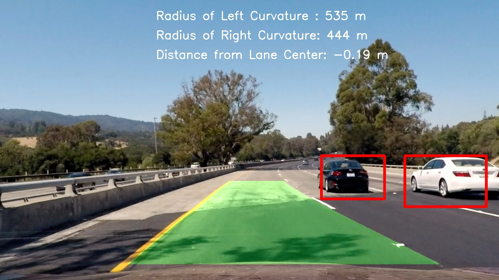

# Vehicle Detection and Tracking

In this project, my goal is to write a software pipeline to detect and track vehicles in images and videos.

The goals / steps of this project can be summarized as follows:

* Perform a Histogram of Oriented Gradients (HOG) feature extraction on a labeled training set of images and train a classifier Linear SVM classifier
* Optionally, apply a color transform and append binned color features, as well as histograms of color, to the HOG feature vector. 
* Normalize the above features and randomize a selection for training and testing.
* Implement a sliding-window technique and use the trained classifier (using Support Vector Machines) to search for vehicles in images.
* Run the pipeline on a video stream and create a heat map of recurring detections frame by frame to reject outliers and follow detected vehicles.
* Estimate a bounding box for vehicles detected.

Here are links to the labeled data for [vehicle](https://s3.amazonaws.com/udacity-sdc/Vehicle_Tracking/vehicles.zip) and [non-vehicle](https://s3.amazonaws.com/udacity-sdc/Vehicle_Tracking/non-vehicles.zip) examples to train the classifier.  These example images come from a combination of the [GTI vehicle image database](http://www.gti.ssr.upm.es/data/Vehicle_database.html), the [KITTI vision benchmark suite](http://www.cvlibs.net/datasets/kitti/), and examples extracted from the project video itself.  

Some example images for testing the pipeline on single frames are located in the [output_images](https://github.com/wafarag/Vehicle-Detection-and-Tracking/tree/master/output_images) folder.  

For more details please check out the [the full report](https://github.com/wafarag/Vehicle-Detection-and-Tracking/blob/master/P5%20Vehicle%20Detection%20Project%20Report%20ver%201.0.pdf).  
Moreover, you may also check out the [vehicle tracking](https://github.com/wafarag/Vehicle-Detection-and-Tracking/blob/master/P5%20VehicleDetect8.py) and [lane detection](https://github.com/wafarag/Vehicle-Detection-and-Tracking/blob/master/P4_AdvLane3.py) source codes.  
The output of the pipeline is demostrated by the following [first sample](https://github.com/wafarag/Vehicle-Detection-and-Tracking/blob/master/project_video_HSV_lane.mp4) and [second sample](https://github.com/wafarag/Vehicle-Detection-and-Tracking/blob/master/project_video_LAB_lane.mp4) output videos.

